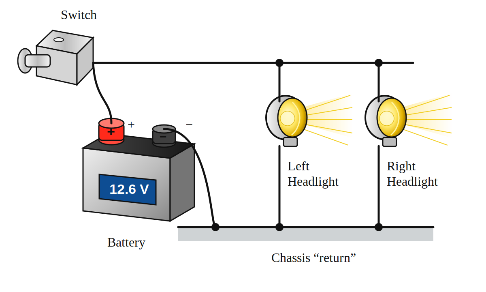
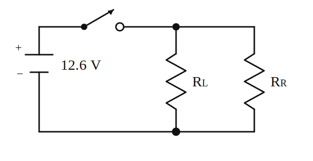
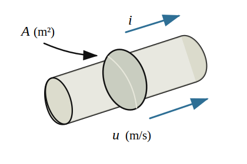

# Chapter 1

# Basic Circuit Theory

## Learning Objectives

After completing this chapter, you should be able to:

1. Understand what a circuit is and why circuits are important in electrical engineering.
2. Understand the definition of current and use Kirchhoff's Current Law (KCL) to express conservation of charge.
3. Understand the definition of voltage and use Kirchhoff's Voltage Law (KVL) to express conservation of electric energy.
4. Understand how to use voltage and current to calculate the power into or out of a circuit element.
5. Understand the relationship between voltage and current in a resistor as described by Ohm's law.
6. Understand how to combine resistances connected in series and how voltage divides between series resistances.
7. Understand how to combine resistances connected in parallel and how current divides between parallel resistances.
8. Understand how to analyze circuits containing one source and resistances in series and parallel.

We begin our study of electrical engineering with the subject of circuits for three reasons. The most important is that almost every electrical device, from a radio to an electric motor, is a circuit, or at least contains circuits. The second reason is that the study of circuits is neither as abstract or as mathematically sophisticated as other electrical subjects such as electromagnetic fields. Finally, this subject has produced the language of electrical engineering. Learning the vocabulary of circuits and you can break into the conversation about electrical engineering.

## 1.1 Introduction to Electrical Engineering

### Place of Electrical Engineering in Modern Technology

#### What Is Electrical Engineering?

Electrical engineering is, in one sense, the opposite of lightning. Lightning unleashes electrical energy unpredictably and destructively. Electrical engineering harnesses electrical energy for human good—for transporting energy and information, for lifting the burdens of toil and tedium. When electrical energy is important for its own sake, to turn motors or illuminate department stores, we think of the electrical power industry. When energy is important for its symbolic (information) content, we think of the electronics industry. Both use electrical energy for beneficial purposes.

This book explains the fundamental ideas and techniques of electrical engineering. Our goal is to provide you with a strong foundation to solve basic and practical problems and to furnish you with a vocabulary of words and ideas for clear thinking and clear communication. All engineers need this background to contribute in a technology that is increasingly electrical.

#### Foundational Ideas in Electrical Engineering

Our focus will be on the ideas upon which electrical engineering is built. These foundational ideas are as follows:

- **Conservation of charge** (Kirchhoff's current law) is one of the fundamental principles used in writing circuit equations.
- **Conservation of energy** (Kirchhoff's voltage law) applies in two forms: conservation of electric energy is one of the fundamental principles used in writing circuit equations; and conservation of energy generally is used in electrical/mechanical systems to develop equations and understanding.
- **The frequency domain** is a way of looking at the physical world in which frequency, not time, is the independent variable.
- **Equivalent circuits** model real devices by ideal electrical devices that have identical or similar characteristics.
- **Impedance level** determines how electrical devices interact.
- **Feedback** is a technique for bringing part of the output of an electronic device back to the input to improve performance.
- **Analog information** uses an electrical signal proportional to the information content.
- **Digital information** uses a two-valued code to represent the information content.

As we introduce, explain, and apply these ideas, we will remind you by the light bulb icon that a certain foundational idea is being used. In this way, we hope to convince you that electrical engineering is based on relatively few ideas; the rest is detail.

#### Why Start with Circuit Theory?

The first part of this book is about electric circuit theory. There are three reasons why we start with circuit theory. It is an easy place to start, neither as abstract nor as mathematically sophisticated as other branches of electrical engineering. More important, practically every electrical device is a circuit. A radio is a circuit, as is the power distribution system that runs your lights and air conditioner. Hence, understanding the methods of circuits opens the door to the study of all areas of electrical engineering.

Finally, the study of circuits provides a logical starting point because circuit theory has generated the language of electrical engineering. Even devices that are more sophisticated than an electrical circuit (an aircraft radar, for example) are described by electrical engineers in the language of circuits. Hence, our study of circuits introduces the ideas and language underlying much of electrical engineering.

### What Is Circuit Theory?

A circuit problem. To see what circuit theory involves, consider the circuit consisting of the battery, light switch, two headlights, and connecting wire and chassis from a car, as shown in Fig. 1.1. When we pull the switch, we expect that the lights will glow and also get hot, which suggests that the battery is supplying energy to the headlights. Figure 1.2 shows an electric circuit representing the physical situation depicted in Fig. 1.1, a 12.6-volt (V) battery symbol and two 5.25-ohm (Ω) resistances, modeling the headlights, with lines representing the wire and chassis return. We may use circuit theory to calculate the current in the wires, the power out of the battery, and the energy into each headlight.

*Figure 1.1. Automotive lighting system.*

*Figure 1.2. Circuit representing the automotive lighting system. The headlights are represented by resistances.*

#### The Nature of Electrical Circuit Theory

Soon we will present the definitions and laws that will allow us to make such calculations. Here we show what circuit theory encompasses. The solution of an engineering problem normally proceeds through four stages: first, a real-world problem is identified; second, the problem is modeled; third, the model is analyzed; and fourth, the results are applied to the original physical problem. In the case of the battery and headlights, we skipped the first and last steps, but we did model a physical situation (battery, switch, and headlight) with common circuit symbols and we plan to analyze the circuit model soon. Circuit theory consists only of the third step: taking a given circuit model and solving for certain results through the application of known circuit laws. This third step is what you will learn to do in the first part of this book. In the remainder, you use circuit theory in learning the principles of electronic and electromechanical systems. We begin with the definitions of current and voltage.

## 1.2 Physical Basis of Circuit Theory

### Energy and Charge

#### Charge Is a Fundamental Physical Quantity

Charge, like mass, is a property of matter; indeed, charge joins mass, length, and time as one of the fundamental units from which all scientific units are derived. The unit of electric charge is the coulomb (abbreviated C), named in honor of Charles de Coulomb (1736–1806). There are two types of charge, positive and negative. The names fit because the two types of charge produce opposite effects. Thus, equations describing the effects of charges encompass both types of charges if we associate a positive number with the one type and a negative number with the other. Traditionally, the electron has been assigned a negative sign and the proton a positive. The magnitude of the charge of the electron is the smallest possible charge; in the MKS system of units, this is

$$
e = -1.602 \times 10^{-19}\ \text{coulombs (C)}
\tag{1.1}
$$

Because the mass of the electron is $9.11 \times 10^{-31}$ kg, the charge-to-mass ratio of the electron is $1.76 \times 10^{11}$ in the MKS system. The charge on the proton is positive in sign and equal in magnitude to that of the electron, but the proton mass is 1846 times greater. Because the charge-to-mass ratio of the fundamental bits of matter is so great, electrical effects usually dominate mechanical inertia effects. Hence, we usually talk about charge as if it were not tied to mass—as if it were massless.

#### Forces Between Charges

We know about electric charges because charges exert forces on other charges. There are two types of forces between charges. Charges attract or repel each other due to electrostatic forces, which are described by Coulomb's law. Electrostatic forces are responsible for lightning, because charges are separated in clouds by droplet separation; and electrostatic forces are used in photocopy machines to form images on glass drums with charged bits of dry ink.

Magnetic forces depend on moving charges (that is, on currents) and are described by Ampere's force law. Magnetic forces turn motors, deflect electron beams in TV tubes, and effect energy conversion in generators. Electrical engineers thus have both electrostatic and magnetic effects to use in manipulating electrical energy.

#### The Importance of Energy

Energy is the medium of exchange in a physical system, like money in an economic system. Energy is exchanged whenever one physical thing affects another. In mechanics, it takes force and movement to do work (exchange energy), and in electricity, it takes electrical force and movement of charges to do work (exchange energy). The electrical force is represented by the voltage and the movement of charge by the current in an electrical circuit.

## 1.3 Current and Kirchhoff's Current Law

### Definition of Current

Current is charge in motion. In the experiment with the battery and headlights described before, we recognize that the headlights glow because of charges moving through the electrical conductors. An electrical conductor has mobile (conduction) electrons capable of moving in response to electric forces. A nonconductor has plenty of charges but its charges cannot move.

Consider a wire with a cross-section of $A\ \text{m}^2$ with charges moving with a velocity $u$ from left to right, as pictured in Fig. 1.3. If in a period of time $\Delta t$, $\Delta Q$ coulombs cross $A$ in the indicated direction, we define the current to be

$$
i = \frac{\Delta Q}{\Delta t}\ \text{C/s or ampere, A}
\tag{1.2}
$$

*Figure 1.3. Wire with current.*

Note that the units of current are coulombs per second, but to honor André Ampère (1775–1836), we give this unit a special name, the ampere (A). A copper wire has a concentration of conduction electrons of $n_e = 1.13 \times 10^{29}$ electrons/m³. If the electrons are moving with a velocity $u$, the number of electrons crossing $A$ in $\Delta t$ would be $\Delta n = n_e A u \Delta t$. Hence, the current would be

$$
i = \frac{\Delta Q}{\Delta t} = \frac{e\Delta n}{\Delta t} = en_eAu\ \text{A}
\tag{1.3}
$$

For example, consider electrons traveling downward in a No. 12 wire (0.081 in. in diameter) at a snail's pace of 0.1 mm/s. From Eq. (1.3), the charges constitute a current of $i=-5.8\ \text{A}$ downward, as shown in Fig. 1.4. We could also express this result by saying that the current is $i=+5.8\ \text{A}$ upward.

> **Editorial note:** This is a working draft reconstructed from page images. It will be tightened as additional figures and source-page references are added.
